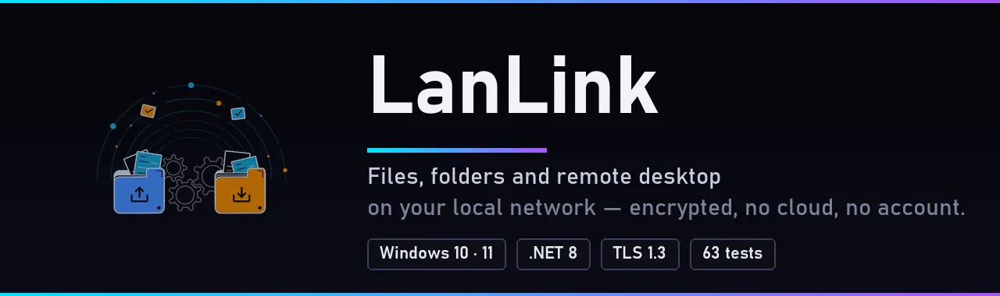

<div align="center">

[🇫🇷 Français](README.md) · **🇬🇧 English**



</div>

LanLink is a Windows application that connects your PCs **directly** to each other, with every communication encrypted.
It replaces the Python "Lan-transfer" version with a rewrite in C# / .NET 8.

> **Note:** the app's interface is currently in **French**. This README gives the exact on-screen labels, with an English translation in parentheses.


## What you can do

| | |
|---|---|
| 📤 **Send** (*Envoyer*) | Whole files and folders, drag and drop, progress, cancel. An interrupted transfer **resumes where it stopped**. |
| 🖥️ **Remote desktop** (*Écran distant*) | View another PC's screen, or control it (mouse, keyboard). Multiple monitors, shared clipboard, sound. |
| 🔄 **Sync** (*Synchronisation*) | Keep a folder identical on two PCs, both ways, automatically. Nothing is lost: overwritten or deleted files go to a trash folder. |
| 💬 **Chat** (*Discuter*) | Send a text message to another PC. |
| 🕘 **History** (*Historique*) | A list of all your transfers, with a shortcut to open the folder. |

Also: automatic discovery of PCs on the network, a notification-area icon (the app keeps running with its window closed), dark / light / system theme.


## Installation

### Option 1 — The ready-to-use executable

Build `LanLink.exe` (a single file, .NET included, nothing to install):

```powershell
dotnet publish src/LanLink.App -c Release -r win-x64 --self-contained true `
  -p:PublishSingleFile=true -p:IncludeNativeLibrariesForSelfExtract=true `
  -p:EnableCompressionInSingleFile=true -o dist
```

Then copy `dist\LanLink.exe` to each of your PCs (USB stick, network share…) and run it.

> Windows may show "Windows protected your PC" because the executable is not signed
> (the message appears in your Windows language): click **More info → Run anyway**.

### Option 2 — From source

You need the [.NET 8 SDK](https://dotnet.microsoft.com/download/dotnet/8.0) or later.

```powershell
git clone https://github.com/ikono85/Lan-transfer.git
cd Lan-transfer
dotnet run --project src/LanLink.App
```


## Getting started (5 minutes)

<picture>
  <source media="(prefers-color-scheme: dark)" srcset="docs/img/reglages-dark.webp">
  
</picture>

Do this **on every PC**:

1. **Start LanLink.** Allow the Windows firewall on **private networks** when it asks.
2. Go to **Réglages → Mot de passe de ce PC** (*Settings → This PC's password*), choose a password (12 characters minimum; a passphrase is ideal) and click **Enregistrer** (*Save*).
   Without a password, a PC refuses all incoming connections.

Then, from the PC that wants to connect to another one:

3. Pick the other PC in **"PC détectés"** (*detected PCs*, left column), or type its IP address.
4. Type **the other PC's password** in the "Destinataire" (*Recipient*) box at the top.
5. Use the tab you want: Envoyer (*Send*), Discuter (*Chat*), Écran distant (*Remote desktop*) or Synchronisation (*Sync*).

The recipient and password entered at the top are shared by all tabs.


## Usage

### 📤 Send files

**Envoyer** tab: add files or a folder (buttons or drag and drop), then **Envoyer** (*Send*).
On the other PC, a window asks to **accept** the transfer; files arrive in the receiving folder (by default *Downloads*, changeable in Réglages / Settings).

- If the connection drops, just send the same item again: the transfer resumes where it stopped.
- Every file is verified on arrival (SHA-256 checksum).

### 🖥️ View or control a screen

**Écran distant** tab: **Voir l'écran** (*View screen*, read-only) or **Voir et contrôler** (*View and control*).

- The user of the other PC must **accept**, and chooses what to allow: control, clipboard, sound.
- While sharing, an **orange bar** stays visible on the shared screen, with a **Arrêter le partage** (*Stop sharing*) button.
- In the viewer window: monitor choice, quality (Économie / Équilibré / Netteté — *Economy / Balanced / Sharp*), sound, keyboard, full screen.
- Keys that are held down are released automatically when the session ends or the connection drops.
- Screen sharing can be turned off entirely in **Réglages → Partage d'écran** (*Settings → Screen sharing*).

**Limits:** the Windows secure desktop (UAC prompt, Ctrl+Alt+Delete) can be neither seen nor controlled, and applications running as administrator ignore clicks unless LanLink itself runs as administrator.

### 🔄 Sync a folder

<picture>
  <source media="(prefers-color-scheme: dark)" srcset="docs/img/synchronisation-dark.webp">
  
</picture>

**Synchronisation** tab: **Créer avec le destinataire du haut…** (*Create with the recipient above…*), pick the local folder.
The other PC sees a request, chooses **its** folder and accepts.

- Sync is **two-way**: new files are copied, changes and deletions are propagated.
- The PC that created it connects **every minute** and 3 seconds after a local change. Changes made on the other PC are picked up on the next pass (a minute at most).
- **Conflict** (file changed on both sides): the most recent version is kept, the other one is set aside.
- **Trash:** every overwritten or deleted file is kept for 30 days in `.lanlink-sync\trash\` at the root of the synced folder.
- **Safeguards:** a mass deletion (emptied folder, unplugged drive) is refused; files still being written are postponed.
- Buttons: sync now, pause / resume, open folder, reset history, delete (removing a sync never deletes any files).

Empty folders are not synced, and a rename is seen as a deletion followed by a new file.

### 💬 Chat

**Discuter** tab: type a message and press **Enter** to send it to the PC selected at the top.


## Security

- **TLS 1.3 encryption** of all communications, with a certificate specific to each PC.
- **Password:** never sent over the network. Every connection proves it is known (Argon2id derivation), and the proof is bound to both PCs' certificates, which stops a man in the middle from slipping into the exchange. The receiving PC is authenticated too, not only the sender.
- **Limited attempts:** after 5 wrong passwords, the address is blocked for 5 minutes.
- **Everything asks for your consent:** incoming transfer, screen sharing, synchronization. You choose what is allowed.
- **Storage:** the certificate and password are encrypted with your Windows account (DPAPI) in `%LOCALAPPDATA%\LanLink\`.
- **Received file names are checked** (no escaping the destination folder, Windows reserved names refused).

⚠️ **Known limitation:** this is not a "zero-knowledge" password protocol. Someone impersonating one of your PCs could try to guess the password offline: **choose a long passphrase**.
LanLink is meant for a **trusted local network** (home, small office), not for the Internet.


## Troubleshooting

| Problem | Solution |
|---|---|
| The other PC does not show up in "PC détectés" | Type its IP address directly (shown in its LanLink window, or via `ipconfig`). Discovery is sometimes blocked by the router or the firewall. |
| "Connexion impossible" (*connection failed*) | Allow LanLink through the Windows firewall (private network), and check both PCs are on the same network and running LanLink. |
| "Mot de passe incorrect" (*wrong password*) | You must type **the other PC's** password at the top, not your own. After 5 failures, wait 5 minutes. |
| "Aucun mot de passe défini sur ce PC" (*no password set on this PC*) | Set one in Réglages (Settings) on the PC you are trying to reach. |
| Remote control does not respond in some windows | These are probably applications running as administrator: run LanLink as administrator on the controlled PC. |
| A sync stays in error | The message is shown in the list. Common causes: folder not found, other PC switched off, password changed (delete and recreate the sync). |
| The app no longer shows up | It is minimized to the notification area: click its icon. |

**Ports used:** TCP 45870 (all traffic) and UDP 45871 (PC discovery).


## Development

```powershell
dotnet build          # build the solution
dotnet test           # 63 unit and end-to-end tests (real TLS on localhost)
dotnet run --project src/LanLink.App
```

| Project | Role |
|---|---|
| `src/LanLink.Core` | Protocol, TLS, authentication, transfer, remote desktop, synchronization, discovery |
| `src/LanLink.App` | WPF interface (MVVM), notification icon, themes, Windows screen capture and input injection |
| `tests/LanLink.Core.Tests` | Tests |

Protocol, security and algorithm details (in French): [docs/TECHNIQUE.md](docs/TECHNIQUE.md).

## Roadmap

### ✅ Done

- ✅ TLS 1.3 encryption with a certificate specific to each PC
- ✅ Argon2id password, proof bound to the certificates, lockout after 5 attempts
- ✅ File and folder transfer, with resume after interruption
- ✅ Transfer history
- ✅ Text chat
- ✅ Automatic discovery of PCs on the network
- ✅ Remote desktop: view, mouse and keyboard, multiple monitors, shared clipboard, sound
- ✅ Two-way folder sync, with trash and a safeguard against mass deletions
- ✅ WPF interface with dark, light and system themes, and a notification-area icon
- ✅ Single-file standalone executable
- ✅ 63 unit and end-to-end tests
- ✅ README in French and English

### ⬜ Coming up

- ⬜ GitHub Release with a downloadable `LanLink.exe`, and automatic builds (GitHub Actions)
- ⬜ Installer and dedicated icon
- ⬜ Code signing of the executable (no more Windows warning)
- ⬜ DXGI screen capture and video encoding (H.264) for better performance
- ⬜ Resume of large files during sync
- ⬜ Rename detection during sync
- ⬜ Sync of empty folders
- ⬜ Parallel transfers
- ⬜ Zero-knowledge password protocol (OPAQUE / SPAKE2)
- ⬜ Access beyond the local network (relay / NAT traversal)
- ⬜ English interface

## License

No license has been chosen yet: until one is specified, all rights are reserved.


