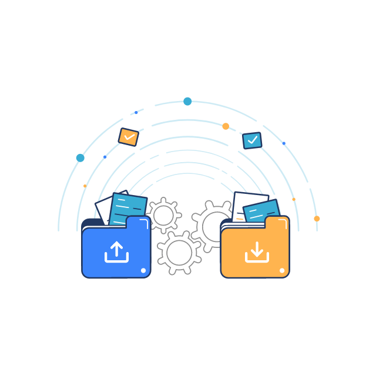

<div align="center">



# LanLink

**Envoie des fichiers, synchronise des dossiers et prends la main sur un autre PC de ton réseau local,<br>sans cloud ni compte.**

   

</div>

LanLink est une application Windows qui relie tes PC entre eux, **directement**, avec toutes les communications chiffrées.
Elle remplace la version Python « Lan-transfer » par une réécriture en C# / .NET 8.

---

## Ce que tu peux faire

| | |
|---|---|
| 📤 **Envoyer** | Fichiers et dossiers entiers, glisser-déposer, progression, annulation. Un envoi coupé **reprend là où il s'est arrêté**. |
| 🖥️ **Écran distant** | Voir l'écran d'un autre PC, ou le contrôler (souris, clavier). Plusieurs écrans, presse-papiers partagé, son. |
| 🔄 **Synchroniser** | Garde un dossier identique sur deux PC, dans les deux sens, automatiquement. Rien n'est perdu : les fichiers écrasés ou supprimés vont dans une corbeille. |
| 💬 **Discuter** | Envoie un message texte à un autre PC. |
| 🕘 **Historique** | Liste de tous tes transferts, avec ouverture du dossier. |

Et aussi : détection automatique des PC du réseau, icône dans la zone de notification (l'app reste active fenêtre fermée), thème sombre / clair / système.

---

## Installation

### Option 1 — L'exécutable prêt à l'emploi

Génère `LanLink.exe` (un seul fichier, .NET inclus, rien à installer) :

```powershell
dotnet publish src/LanLink.App -c Release -r win-x64 --self-contained true `
  -p:PublishSingleFile=true -p:IncludeNativeLibrariesForSelfExtract=true `
  -p:EnableCompressionInSingleFile=true -o dist
```

Copie ensuite `dist\LanLink.exe` sur chacun de tes PC (clé USB, partage réseau…) et lance-le.

> Windows peut afficher « Windows a protégé votre ordinateur » car l'exécutable n'est pas signé :
> clique sur **Informations complémentaires → Exécuter quand même**.

### Option 2 — Depuis les sources

Il faut le [SDK .NET 8](https://dotnet.microsoft.com/download/dotnet/8.0) ou plus récent.

```powershell
git clone https://github.com/ikono85/Lan-transfer.git
cd Lan-transfer
dotnet run --project src/LanLink.App
```

---

## Premiers pas (5 minutes)


À faire **sur chaque PC** :

1. **Lance LanLink.** Autorise le pare-feu Windows sur les **réseaux privés** quand il te le demande.
2. Va dans **Réglages → Mot de passe de ce PC**, choisis un mot de passe (12 caractères minimum, une phrase de passe est idéale) et clique sur **Enregistrer**.
   Sans mot de passe, un PC refuse toutes les connexions entrantes.

Ensuite, depuis le PC qui veut se connecter à un autre :

3. Choisis l'autre PC dans **« PC détectés »** (colonne de gauche), ou saisis son adresse IP.
4. Tape **le mot de passe de l'autre PC** dans le cadre « Destinataire » en haut.
5. Utilise l'onglet de ton choix : Envoyer, Discuter, Écran distant ou Synchronisation.

Le destinataire et le mot de passe saisis en haut servent à tous les onglets.

---

## Utilisation

### 📤 Envoyer des fichiers

Onglet **Envoyer** : ajoute des fichiers ou un dossier (boutons ou glisser-déposer), puis **Envoyer**.
Sur l'autre PC, une fenêtre demande d'**accepter** le transfert ; les fichiers arrivent dans le dossier de réception (par défaut *Téléchargements*, modifiable dans Réglages).

- Si la connexion est coupée, renvoie simplement le même élément : le transfert reprend là où il s'est arrêté.
- Chaque fichier est vérifié à l'arrivée (empreinte SHA-256).

### 🖥️ Voir ou contrôler un écran

Onglet **Écran distant** : **Voir l'écran** (lecture seule) ou **Voir et contrôler**.

- L'utilisateur de l'autre PC doit **accepter** et choisit ce qu'il autorise : contrôle, presse-papiers, son.
- Pendant le partage, une **barre orange** reste affichée sur l'écran partagé, avec un bouton **Arrêter le partage**.
- Dans la fenêtre de visualisation : choix du moniteur, qualité (Économie / Équilibré / Netteté), son, clavier, plein écran.
- Les touches enfoncées sont relâchées automatiquement à la fin de la session ou en cas de coupure.
- On peut désactiver complètement le partage d'écran dans **Réglages → Partage d'écran**.

**Limites :** l'écran de sécurité de Windows (fenêtre UAC, Ctrl+Alt+Suppr) n'est ni visible ni pilotable, et les applications lancées en administrateur ignorent les clics tant que LanLink n'est pas lui-même lancé en administrateur.

### 🔄 Synchroniser un dossier


Onglet **Synchronisation** : **Créer avec le destinataire du haut…**, choisis le dossier local.
L'autre PC voit une demande, choisit **son** dossier et accepte.

- La synchronisation va **dans les deux sens** : fichiers nouveaux copiés, modifications et suppressions propagées.
- Le PC qui l'a créée se connecte **toutes les minutes** et 3 secondes après une modification locale. Les changements de l'autre PC sont repris à la passe suivante (une minute au plus).
- **Conflit** (fichier modifié des deux côtés) : la version la plus récente est gardée, l'autre est mise de côté.
- **Corbeille :** tout fichier écrasé ou supprimé est conservé 30 jours dans `.lanlink-sync\trash\` à la racine du dossier synchronisé.
- **Garde-fous :** une suppression massive (dossier vidé, disque débranché) est refusée ; les fichiers encore en cours d'écriture sont reportés.
- Boutons : synchroniser maintenant, pause / reprise, ouvrir le dossier, réinitialiser l'historique, supprimer (les fichiers ne sont jamais supprimés en retirant une synchronisation).

Les dossiers vides ne sont pas synchronisés, et un renommage est vu comme une suppression suivie d'un nouveau fichier.

### 💬 Discuter

Onglet **Discuter** : écris un message, **Entrée** pour l'envoyer au PC choisi en haut.

---

## Sécurité

- **Chiffrement TLS 1.3** de toutes les communications, avec un certificat propre à chaque PC.
- **Mot de passe** : jamais envoyé sur le réseau. Chaque connexion prouve qu'on le connaît (dérivation Argon2id), et la preuve est liée aux certificats des deux PC, ce qui empêche un intermédiaire de se glisser dans l'échange. Le PC destinataire est authentifié aussi, pas seulement l'expéditeur.
- **Essais limités :** après 5 mots de passe incorrects, l'adresse est bloquée 5 minutes.
- **Tout demande ton accord :** transfert entrant, partage d'écran, synchronisation. Tu choisis ce qui est autorisé.
- **Stockage :** certificat et mot de passe sont chiffrés avec ton compte Windows (DPAPI) dans `%LOCALAPPDATA%\LanLink\`.
- **Noms de fichiers reçus vérifiés** (pas de sortie du dossier de destination, noms réservés Windows refusés).

⚠️ **Limite connue :** ce n'est pas un protocole à mot de passe « zéro connaissance ». Quelqu'un qui se ferait passer pour l'un de tes PC pourrait tenter de deviner le mot de passe hors ligne : **choisis une phrase de passe longue**.
LanLink est prévu pour un **réseau local de confiance** (maison, petit bureau), pas pour Internet.

---

## Dépannage

| Problème | Solution |
|---|---|
| L'autre PC n'apparaît pas dans « PC détectés » | Saisis directement son adresse IP (visible sur son écran LanLink ou par `ipconfig`). La découverte est parfois bloquée par le routeur ou le pare-feu. |
| « Connexion impossible » | Autorise LanLink dans le pare-feu Windows (réseau privé), vérifie que les deux PC sont sur le même réseau et que LanLink tourne sur les deux. |
| « Mot de passe incorrect » | C'est le mot de passe **de l'autre PC** qu'il faut taper en haut, pas le tien. Après 5 échecs, patiente 5 minutes. |
| « Aucun mot de passe défini sur ce PC » | Définis-en un dans Réglages sur le PC que tu essaies de joindre. |
| Le contrôle à distance ne répond pas dans certaines fenêtres | Ce sont sans doute des applications lancées en administrateur : lance LanLink en administrateur sur le PC contrôlé. |
| Une synchronisation reste en erreur | Le message est affiché dans la liste. Les causes fréquentes : dossier introuvable, autre PC éteint, mot de passe modifié (supprime et recrée la synchronisation). |
| L'app ne s'affiche plus | Elle est réduite dans la zone de notification : clique sur son icône. |

**Ports utilisés :** TCP 45870 (tout le trafic) et UDP 45871 (découverte des PC).

---

## Développement

```powershell
dotnet build          # compile la solution
dotnet test           # 63 tests unitaires et de bout en bout (vrai TLS sur localhost)
dotnet run --project src/LanLink.App
```

| Projet | Rôle |
|---|---|
| `src/LanLink.Core` | Protocole, TLS, authentification, transfert, écran distant, synchronisation, découverte |
| `src/LanLink.App` | Interface WPF (MVVM), icône de notification, thèmes, capture d'écran et injection Windows |
| `tests/LanLink.Core.Tests` | Tests |

Détails du protocole, de la sécurité et des algorithmes : [docs/TECHNIQUE.md](docs/TECHNIQUE.md).

## Feuille de route

- Installateur et icône dédiée
- Capture d'écran DXGI et encodage vidéo (H.264) pour de meilleures performances
- Reprise des gros fichiers en synchronisation, détection des renommages
- Transferts en parallèle
- Accès hors réseau local (relais / traversée de NAT)

## Licence

Aucune licence n'a encore été choisie : tant qu'elle n'est pas précisée, tous droits réservés.
